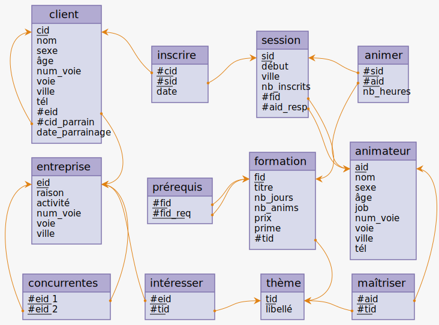
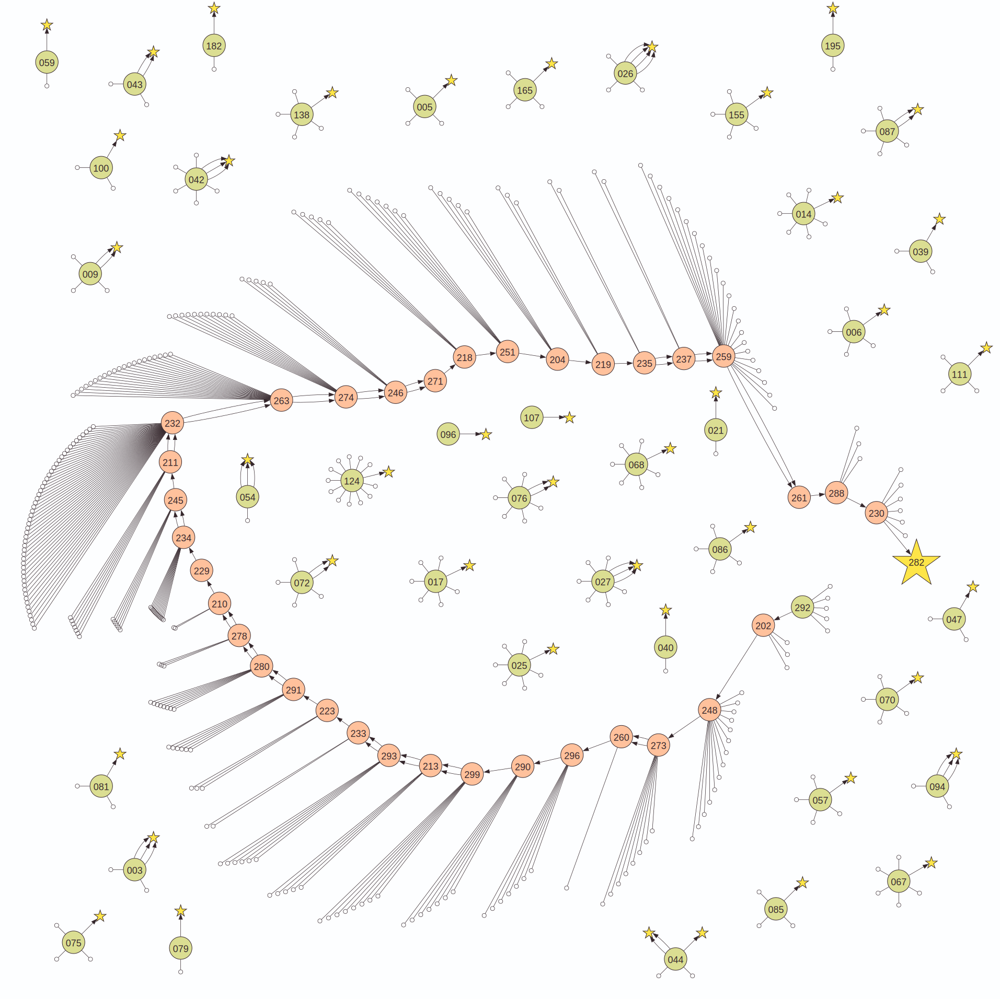

# 🍉 Sessions de formation

_Une collection d'exercices et un thriller relationnel pour apprendre et pratiquer SQL._

---

## Principe

Cette base a été générée par [SQLab](https://github.com/laowantong/sqlab) : elle contient à la fois des **données** et des **exercices de SQL** sur ces données.

Les tables-métier (celles sur lesquelles vous travaillerez) sont les suivantes :



<details><summary>Pour référence, le schéma conceptuel correspondant.</summary></details>


**Remarque.** Notez les accents dans certains noms (« thème », « âge »), ainsi que la forme des clés : « xid », où « x » est l'initiale du nom de la table identifiée. Les valeurs de ces clés sont de la forme « Xn », où « n » est un entier positif.

Une base SQLab inclut également une **table de messages** : éléments narratifs, explications, énoncés de questions, pistes personnalisées en cas de réponses fausses, enfin solutions et variantes éventuelles.

Chaque message est chiffré par une clé cryptographique distincte (ou **token**).

L'énoncé d'une question vous fournira toujours une formule de calcul de token, p. ex. `, salt_042(sum(A.hash + B.hash) over()) as token`.

Imaginons que votre réponse « brute » consiste en la requête SQL suivante :

```sql
SELECT A.foo
     , B.bar
FROM bizz A
JOIN buzz B ON A.foobar = B.foobar
```

Copiez-collez la formule de token dans la clause `SELECT` :

```sql
SELECT A.foo
     , B.bar
     , salt_042(sum(A.hash + B.hash) over()) as token
FROM bizz A
JOIN buzz B ON A.foobar = B.foobar
```

Exécutez cette requête. La table résultante comportera une colonne `token` avec la même valeur sur toutes les lignes. Insérez cette valeur dans les parenthèses de la requête de déchiffrement suivante :

```sql
SELECT decrypt()
```

Trois cas peuvent alors se présenter :
- 🔴 Votre réponse est complètement fausse, et le système ne voit pas comment vous aider à la corriger.
- 🟠 Votre réponse est presque juste, et le système vous donne une piste.
- 🟢 Votre réponse est juste, et le système vous félicite, affiche la correction officielle et, le cas échéant, l'épisode suivant.

<!---
## Récupération de la base `sessform`

La base de données est actuellement disponible en deux versions :

1. Pour MySQL 8 ou supérieur : [téléchargez mysql/dump.sql](https://raw.githubusercontent.com/laowantong/sqlab_sessform/main/mysql/dump.sql) (clic droit / « Télécharger le fichier lien sous… ») et exécutez :
    ```bash
    mysql -u username -p < dump.sql
    mysql -u username -p sessform
    ```

2. Pour PostgreSQL : [téléchargez postgresql/dump.sql](https://raw.githubusercontent.com/laowantong/sqlab_sessform/main/postgresql/dump.sql) (clic droit / « Télécharger le fichier lien sous… ») et exécutez :
    ```bash
   psql -U username -f dump.sql
   psql -U username sessform
   ```
-->

## Contenu de la boîte

La base inclut :

1. des exercices indépendants (énoncés [pour MySQL](mysql/exercises.md)<!--- et [pour PostgreSQL](postgresql/exercises.md)-->) :
    - une trentaine de niveau élémentaire (tokens entre 1 et 99). Chacun ne présente qu'une seule difficulté et a pour but de rafraîchir vos souvenirs du cours. Ils constituent une sorte de tutoriel ;
    - une dizaine d'exercices de niveau plus avancé (tokens entre 100 et 199). Chacun combine plusieurs notions de base. Vous pouvez voir l'ensemble comme une sorte d'examen blanc ;
2. une enquête policière, _Mortelles Sessions_ (tokens entre 200 et 299). Pour accéder au premier épisode, exécutez :
   
    ```sql
    SELECT decrypt(292)
    ```

    Elle compte 36 épisodes, à travers lesquels vous progresserez en composant des requêtes de difficulté progressive.



Le plan de la base (ci-dessus dans sa version MySQL) s'interprète ainsi :

- Chaque sommet représente une question.
- Les verts sont des points d'entrée : ils portent un numéro qui sert aussi de token d'accès.
- Les rouges sont également numérotés, mais ne peuvent être atteints qu'en ayant suivi un chemin d'arcs depuis un sommet vert, autrement dit, en ayant résolu toutes les questions précédentes.
- Certains arcs sont multiples, ce qui signifie que la solution admet une ou plusieurs variantes (qui vous seront systématiquement présentées dans la correction).
- Les petits sommets blancs représentent les erreurs pour lesquelles une indication a été prévue dans la base. Comme la plupart correspondent à des erreurs réellement commises par des étudiants, vous pouvez considérer leur nombre comme plus ou moins proportionnel à la difficulté.
- Quand vous arrivez à une étoile, vous avez fini soit un exercice, soit l'aventure complète !


Bonne enquête et surtout… bonnes requêtes !

<br>

![Illustration : « A reimagined, expansive, and heavily unbalanced surreal illustration of a herd of walruses in a data center, with an enriched and varied background to break the symmetry further. The scene includes diverse elements like scattered computers, random doors, desks, and other office paraphernalia, creating a cluttered, chaotic look. The server racks are irregularly placed, some tilted or collapsed, with red LEDs flickering sporadically. The walruses are in bizarre poses, with their glowing red eyes adding to the eerie mood. Shadows loom large and uneven, while cables and tech debris contribute to the sense of disorder and dread in this suspenseful and unconventional thriller setting. » (DALL·E 2023-11-15 10.02.12).](assets/cover.jpg)
<div align="center">
  <i>Mortelles sessions : l'attaque des morses géants.</i>
</div>


## Crédits

Aristide Grange (université de Lorraine, laboratoire LCOMS) est l'auteur :

- de la présente collection d'exercices, de l'enquête _Mortelles Sessions_ et des données fictives sous-jacentes.
- de [SQLab](https://github.com/laowantong/sqlab), l'outil qui a servi à générer la base.
- de [Mocodo](https://mocodo.net) pour les diagrammes relationnel et conceptuel.
